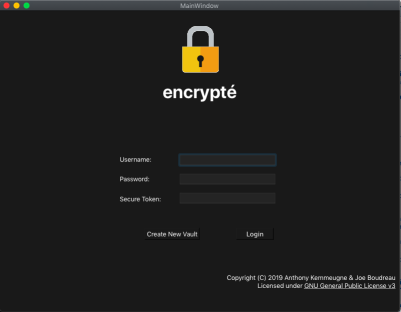

# encrypté
### Password Vault with TOTP based 2FA

Encrypté is used to store and protect user's passwords in a local device. Unlike the other password manager solutions available that store user passwords in the cloud, encrypté guarantees that the user information will remain locally stored​

The application uses 2FA (Two Factor Authentication): the user password and a TOTP (Time-based One Time Password) based on [RFC 6238](https://tools.ietf.org/html/rfc6238)​

Encrypté uses AES-256 encryption for user data storage
